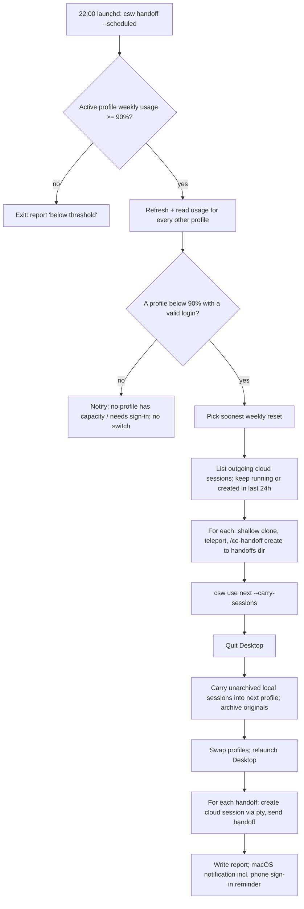

# Nightly Account Handoff - Plan

## Goal Capsule

- **Objective:** When the active Claude account is nearly out of weekly usage, the user's work continues on the next account the following morning without the user watching usage, writing handoffs, or losing track of any task.
- **Means:** A `csw` routine that runs at 22:00, moves open work to the next profile, switches accounts, and reports what moved.
- **Product authority:** The user (repository owner of the `raineorshine/claude-switch` fork). Decisions below were settled in dialogue on 2026-09-27.
- **Open blockers:** None for building. Before the first real run, the saved logins for `overflow1` and `overflow2` must be renewed by signing in again; both refresh tokens are rejected as invalid (see Dependencies / Assumptions).
- **Execution profile:** `ce-work` implements U1–U7 in order on branch `claude/csw-nightly-handoff`; the user runs the first real switch.
- **Stop conditions:** Stop and report if any external call in KTD1–KTD4 behaves differently from what this plan records, or if a change would alter plain `csw use` behavior for users who do not opt in.
- **Product Contract preservation:** Product Contract unchanged except Dependencies / Assumptions (new findings added) and Outstanding Questions (resolved into KTD4, KTD5, KTD10).

---

## Product Contract

### Summary

A nightly `csw` routine checks usage at 22:00 and, when the active account is at or above 90% of its weekly limit, moves the user's work to the next account and switches to it. Open local Code sessions are carried into the next profile with their full history; recent cloud sessions continue as new cloud sessions on the next account from a `/ce-handoff`. One notification reports what moved and reminds the user to sign the phone in.

### Problem Frame

The user runs Claude Desktop and the Claude mobile app across three accounts (`primary`, `overflow1`, `overflow2`) managed by `csw`, burning roughly 26% of an account's weekly limit per day, so one account switch is needed each week. Desktop can be signed into only one account at a time, so a switch is all-at-once: `csw use` quits Desktop, and every session belonging to the old profile disappears from Desktop and from the phone. Today the user must watch the usage percentage, run `/ce-handoff` in each active session by hand, switch, and then rebuild context on the new account. Handoffs are slow and interrupt running sessions, so this cannot happen during the working day. Many local projects (for example keyboard-shortcut daemons) cannot run in the cloud, so continuing work in the cloud is not a universal answer.

### Key Decisions

- **Runs at 22:00, triggered by a 90% weekly-usage threshold.** Handoffs are slow and the switch interrupts sessions, so it happens once, at night. Governs R1, R2. (session-settled: user-directed — chosen over switching mid-day as soon as the threshold is hit: handoffs take long and interrupt current sessions)
- **Local sessions are carried over, not handed off.** Copying a session's Desktop record and history into the next profile keeps full history, costs no usage, and keeps Mac-only projects running on the Mac. Governs R5, R6, R7. (session-settled: user-approved — chosen over writing handoffs for local sessions: a carry-over test within `primary` showed Desktop lists the copied session and continues it from its original history)
- **Every open local session carries over, not only recent ones.** Carrying over costs nothing, so cold sessions are ready on the new account when the user resumes them. Governs R5. (session-settled: user-directed — chosen over only running sessions plus those started in the last 24 hours: no cost to include cold sessions)
- **Cloud sessions continue as new cloud sessions from a `/ce-handoff`.** Cloud sessions belong to the account that created them; a new session on the next account with the same context lets the task continue and is listed in Desktop, on the phone, and on claude.ai. Governs R8, R9, R10. (session-settled: user-directed — chosen over keeping the original cloud entries listed: continuing the task matters, not the original entry)
- **Only running cloud sessions and open cloud sessions started in the last 24 hours are handed off.** Each handoff costs usage on the outgoing account; cold cloud sessions stay behind. Governs R8. (session-settled: user-directed — chosen over handing off every cloud session: cold sessions wait on the user's own decisions or research)
- **Handoffs run in a background copy of each session.** The live session is never messaged or interrupted; `/ce-handoff create` runs in a forked or downloaded copy. Governs R9. (session-settled: user-approved — chosen over messaging each session to run `/ce-handoff`: the app does not allow scheduled runs to message sessions, and messaging interrupts work)
- **A request-level proxy (TeamClaude) is not used.** Cloud sessions and mobile chats must follow the signed-in account, which only a real account switch achieves. (session-settled: user-directed — chosen over TeamClaude's per-request account pooling: cloud sessions, mobile chats and Desktop are a hard requirement)
- **The carried session stays one conversation.** A carried local session is archived in the profile it left, so the same task is not continued in two places, and a later carry-over back replaces the stale copy instead of duplicating it. Governs R7.
- **A manual run and a dry run exist alongside the schedule.** The user and the agent can see exactly what would move before trusting the 22:00 run. Governs R14, R15.

### Requirements

**Trigger and account choice**

- R1. At 22:00 local time every day, the routine checks the active profile's weekly usage and does nothing further when it is below 90%.
- R2. The schedule runs whether or not Claude Desktop is open.
- R3. `csw` can report the 5-hour and weekly usage, with reset times, for every saved profile, including inactive ones.
- R4. The next profile is the one whose weekly limit resets soonest among profiles below the threshold; when none qualifies, the routine switches nothing and says so in its report.

**Local Code sessions**

- R5. Every open (not archived) local Code session in the outgoing profile is carried into the next profile.
- R6. A carried session appears in the Desktop sidebar on the next account with its original title and working folder, and continues from its full history.
- R7. After a carry-over, the session is archived in the outgoing profile; carrying a session into a profile that already holds an older copy of it replaces that copy.

**Cloud Code sessions**

- R8. Cloud sessions on the outgoing account that are running, or open and started in the last 24 hours, are handed off; other cloud sessions stay behind.
- R9. Each handoff is written by running `/ce-handoff create` in a copy of the session, without messaging or interrupting the original.
- R10. After the switch, each handoff starts a new cloud session on the next account whose first message carries the handoff's content, so it is listed in Desktop, on the phone, and on claude.ai.
- R11. Downloading a cloud session to write its handoff never touches the user's own checkouts.

**Switch and report**

- R12. Handoffs are written before the switch; the switch happens after every handoff has finished or failed.
- R13. After the switch, one macOS notification reports how many sessions were carried and handed off, names any that failed, and reminds the user to sign the Claude mobile app in to the next account; a fuller report is saved where the user can open it.
- R14. The routine can be run on demand, not only at 22:00.
- R15. A dry run reports what would be carried, handed off, and chosen as the next profile, without changing anything.

**Failure behavior**

- R16. A failed handoff or carry-over for one session does not stop the rest; it is listed in the report, and the session remains available on the outgoing account.
- R17. When the next profile's saved login is missing or expired, the routine does not switch and the report says which profile needs signing in.

### Acceptance Examples

- AE1. **Covers R1, R4.** Given `primary` at 77% and `overflow1` at 0%, when the 22:00 run fires, then nothing is moved or switched.
- AE2. **Covers R1, R4, R5, R12.** Given `primary` at 92% resetting Thursday and `overflow1` at 0% resetting Friday, when the 22:00 run fires, then open local sessions are carried into `overflow1` and Desktop reopens on `overflow1`.
- AE3. **Covers R8.** Given three cloud sessions — one running, one started 3 hours ago and idle, one started 3 days ago and idle — when the run fires above threshold, then the first two are handed off and the third stays on the outgoing account.
- AE4. **Covers R7.** Given a session carried from `primary` to `overflow1` last week and continued there, when a later run carries it from `overflow1` back to `primary`, then `primary` shows one copy of it, with the newer history.
- AE5. **Covers R4.** Given every other profile at or above 90%, when the run fires above threshold, then nothing is switched and the report says no profile has capacity.
- AE6. **Covers R15.** Given the dry-run option, when it runs at 95%, then it lists the sessions and next profile it would use, and no file, profile, or Desktop state changes.

### Scope Boundaries

- Chats (Desktop Chat tab and mobile chats) are not moved; they stay on the outgoing account and remain readable on claude.ai signed into it.
- Signing the Claude mobile app in to the next account stays manual; the notification only reminds.
- Switching mid-day, or as soon as the threshold is crossed, is not supported.
- Automatic switching back to an account after its weekly reset is not included; the next switch happens only when the new active account reaches the threshold.
- Contributing the feature upstream to `mtxr/claude-switch` is a follow-up, not part of this work.

### Dependencies / Assumptions

- A carry-over tested within `primary` on 2026-09-27: a session record and history written from outside Desktop was listed after a Desktop restart and continued from its original history. Carrying into a profile signed into a different account is assumed to work the same way and is confirmed at the first real switch.
- Claude Code's CLI can load a local session's history into a headless forked copy (`claude -p --resume <id> --fork-session`) and download a cloud session headlessly (`claude -p --teleport <id>`); both were tested on 2026-09-27.
- Creating a new cloud session is interactive-only in the CLI (`--cloud` rejects `--print`); running it through a simulated terminal created a session, and a headless follow-up message (`claude -p "<msg>" --cloud <id>`) was answered. Both were tested on 2026-09-27.
- Desktop keeps one JSON record per local Code session under `~/Library/Application Support/Claude/claude-code-sessions/<accountUuid>/<organizationUuid>/`, holding archived state, creation time, last activity, and the CLI session id; Desktop reads these records at launch. The two ids come from `oauthAccount` in each profile's `~/.claude.<profile>.json` (checked for all three profiles on 2026-09-27).
- A session's history lives at `~/.claude.<profile>/projects/<slug>/<cliSessionId>.jsonl`, plus a same-named directory for subagent and tool-result files; `<slug>` is the working folder with every non-alphanumeric character replaced by `-`.
- Saved logins in `csw-code-<profile>` expire; reading an inactive profile's usage needs a token refresh first. On 2026-09-27 the refresh endpoint rejected both `overflow1`'s and `overflow2`'s refresh tokens as invalid (most likely rotated by `claude-swap` earlier that day), so both profiles need signing in again before a switch can use them.
- Anthropic's usage endpoint and cloud-session list both answered on 2026-09-27 with the active login (see KTD1, KTD4).
- At a burn of about 26% a day, an account at 85% at 22:00 reaches its limit before the next night's check; the user accepted the fixed 90% threshold.

### Sources / Research

- Profile switching: `src/profile.zig` (`cmdUse` quits Desktop, swaps profiles, relaunches), `src/desktop.zig` (directory renames of `Claude.<profile>`), `src/paths.zig` (symlinks for `~/.claude` and `~/.claude.json`).
- Per-profile Code logins in the Keychain: `src/profile.zig` (`csw-code-<profile>`), `src/keychain.zig` (`security` CLI wrapper).
- Existing HTTP: `src/main.zig` update check shells out to `curl` with `--max-time`.
- Handoff skill: Compound Engineering `ce-handoff` (`create` never asks questions and honors a requested destination; `resume` stops for the user).

---

## Planning Contract

### Key Technical Decisions

- KTD1. **Usage comes from Anthropic's OAuth usage endpoint, called with each profile's own login.** `GET https://api.anthropic.com/api/oauth/usage` with `anthropic-beta: oauth-2025-04-20` returns `five_hour` and `seven_day` blocks, each with `utilization` (percent) and `resets_at`. The active profile uses the live `Claude Code-credentials` login; inactive profiles use `csw-code-<profile>`. Governs R3.
- KTD2. **An expired saved login is refreshed through `https://platform.claude.com/v1/oauth/token` and written back at once.** The request is a `refresh_token` grant with Claude Code's public client id `9d1c250a-e61b-44d9-88ed-5944d1962f5e`. Refresh rotates the refresh token, so the new login is written back to the same Keychain entry before anything else runs; for the active profile it is written to both `Claude Code-credentials` and `csw-code-<active>`. A rejected refresh (`invalid_grant`) marks the profile as needing sign-in. Governs R3, R17.
- KTD3. **All HTTP goes through `curl`, with secrets passed on stdin and a CLI-style `User-Agent`.** This matches the existing update check. Tokens go in a `curl --config -` block on stdin so they never appear in process arguments. Cloudflare rejects Python's and curl's default agents on the token endpoint (error 1010), so every request sends `User-Agent: claude-cli/<version> (external, cli)`.
- KTD4. **Cloud sessions are listed with `GET https://api.anthropic.com/v1/sessions`.** Headers: `anthropic-beta: ccr-byoc-2025-07-29`, `anthropic-version: 2023-06-01`, `x-organization-uuid: <org>`; paging through `has_more` / `last_id`. A session is a cloud session when `environment_kind` is `anthropic_cloud` (`bridge` entries are local sessions served over Remote Control and are excluded). "Running" is `session_status == "running"`; "started in the last 24 hours" is `created_at`. How the list marks archived sessions is confirmed during implementation (see Open Questions). Governs R8.
- KTD5. **Cloud handoffs run `claude -p --teleport <id>` in a throwaway shallow clone, asking `/ce-handoff create` to write `HANDOFF.md` at the clone's root.** The clone is made from the session's GitHub repository, checked out on the session's branch, into a temporary directory (an empty temporary directory when the session has no repository); it is kept until that session's continuation (KTD6) has been created, then deleted (R11). The teleport never runs with `--dangerously-skip-permissions` or a bypass permission mode: it gets `--allowedTools` limited to read-only tools plus `Write` for that one `HANDOFF.md`. After it exits, csw checks the file and moves it into the handoffs directory. Handoff files and the nightly report live under `~/Library/Application Support/csw/handoffs/<date>/`, not the OS-managed `/tmp` store. Governs R9, R11, R13.
- KTD6. **The continuation cloud session is created through a pseudo-terminal, then sent the handoff headlessly.** `claude --cloud "<title>"` runs under `script` so the interactive-only create succeeds; its output yields the new `session_…` id; `claude -p "<handoff text>" --cloud <id>` sends the handoff as the first message. The create runs with that session's KTD5 clone as its working directory, so the new session targets the same repository and branch; the pty process is ended as soon as the id is parsed. Every `claude` subprocess in the routine (teleport, create, send) has a wall-clock timeout, and a timeout counts as that session's failure (R16) instead of delaying the switch. Both run after the switch, so the CLI is signed into the next account. If implementation finds a supported API create call, prefer it. Governs R10.
- KTD7. **Local carry-over runs inside the switch, after Desktop quits and before it relaunches.** Desktop rewrites its records while running and reads them at launch, so copying outside that window is unsafe. `desktop.quit` kills only the `Claude` app process, so the step first waits (up to 30 seconds) for Desktop-spawned `claude` session processes to exit, then sends them SIGTERM; a session whose process is still alive is counted as failed and left unarchived (R16). For each unarchived record in the outgoing profile: copy the history file and its sibling directory into the next profile's `projects/<slug>/`; copy the record, keeping its `sessionId` and `cliSessionId`, into the next profile's `claude-code-sessions/<accountUuid>/<organizationUuid>/`; then set `isArchived: true` on the outgoing record. An existing record with the same `sessionId` in the target is replaced, and its history with it. Governs R5, R6, R7.
- KTD8. **Carry-over is opt-in on `csw use`, and the nightly routine opts in.** `csw use <name> --carry-sessions` adds KTD7 to the switch; plain `csw use` is unchanged. This keeps upstream behavior intact for other users.
- KTD9. **New commands: `csw usage`, `csw next`, `csw handoff`, and `csw schedule`.** `csw handoff` runs the whole routine, with `--dry-run` (R15) and `--force` (ignore the threshold for a manual run, R14). `csw schedule install|uninstall|status` manages a launchd agent. Governs R1, R2, R14, R15.
- KTD10. **The 22:00 trigger is a launchd LaunchAgent with `StartCalendarInterval` Hour 22 Minute 0.** It runs `csw handoff --scheduled` with an explicit `PATH` that includes the directory holding `claude`. launchd runs a missed calendar job when the Mac wakes, which could move the switch into the working day, so `--scheduled` acts only inside a night window of 22:00–06:00 local time: started outside it, the run switches nothing and notifies that the nightly run was missed, with the current weekly usage. The window is checked again immediately before the switch. Governs R1, R2.
- KTD11. **The notification uses `osascript` with the message and title passed as script arguments (`on run argv` … `display notification (item 1 of argv) with title (item 2 of argv)`), never spliced into the script text, since the message can contain session titles; the full report is a Markdown file beside the handoffs.** The README's statement that csw writes nothing to disk is updated to name these files. Governs R13.

### High-Level Technical Design

The nightly run, in order. Handoffs finish before the switch because they need the outgoing account's login; continuations start after it because they need the next account's.



Record transformation during carry-over, as directional guidance:

```text
outgoing  Claude/claude-code-sessions/<acctA>/<orgA>/local_X.json   isArchived:false
          ~/.claude.<A>/projects/<slug>/<cli>.jsonl (+ <cli>/)
    ──►
target    Claude.<B>/claude-code-sessions/<acctB>/<orgB>/local_X.json   same sessionId, same cliSessionId
          ~/.claude.<B>/projects/<slug>/<cli>.jsonl (+ <cli>/)
outgoing  local_X.json   isArchived:true
```

### Assumptions

- The Desktop record fields that name MCP connectors and Chrome tab groups are harmless under a different account; the tested record kept them and worked. Implementation removes only fields that fail on the first real switch.
- `ce-handoff create` writes to a destination named in its prompt; the teleported session has the Compound Engineering plugin available because it runs on this Mac with the user's plugins.

### Open Questions

**Deferred to Implementation**

- Which field in the `/v1/sessions` response marks an archived cloud session, or whether archived sessions are omitted.
- How a cloud session's repository is read from `session_context` for the clone in KTD5, and what to do for a session with no repository (run the teleport in an empty temporary directory).
- Whether an API call can create a cloud session directly, replacing the pseudo-terminal in KTD6.

---

## Implementation Units

### U1. OAuth logins and `csw usage`

**Goal:** Read 5-hour and weekly usage for every saved profile, refreshing expired saved logins safely.
**Requirements:** R3, R17; KTD1, KTD2, KTD3.
**Dependencies:** none.
**Files:** `src/http.zig` (new), `src/oauth.zig` (new), `src/usage.zig` (new), `src/main.zig`, `src/keychain.zig` (only if an account-preserving write helper is missing).
**Approach:**
1. `http.zig`: run `curl` with a `--config -` block on stdin (URL, headers, method, body), `--max-time`, the CLI `User-Agent`; return status and body.
2. `oauth.zig`: parse the `claudeAiOauth` JSON from a Keychain entry; decide expired from `expiresAt`; refresh per KTD2 and write back before returning; map `invalid_grant` to a needs-sign-in error.
3. `usage.zig`: parse the usage response into `{five_hour, seven_day}` with percent and reset time; `csw usage` prints one row per profile, marking the active one and any that need sign-in.
4. Register `usage` in `main.zig` dispatch and help text.
**Patterns to follow:** update check in `src/main.zig` (curl subprocess, JSON via `std.json`); `keychain.get`/`getAccount`/`set` in `src/keychain.zig`; `*In(base)` functions for testable paths.
**Test scenarios:**
- Parse a usage fixture with `utilization: 79.0` and `resets_at` → weekly 79%, reset time parsed.
- Parse a fixture where `seven_day` is null → reported as unknown, not 0%.
- `expiresAt` in the past → treated as expired; in the future → not expired.
- Refresh response with a new `refresh_token` → both tokens and `expiresAt` updated in the stored JSON, other fields preserved.
- Refresh error body `{"error":"invalid_grant"}` → needs-sign-in result, stored login untouched.
- curl config builder never places the token in argv.
**Verification:** `csw usage` shows `primary` with the same weekly percentage as the Desktop usage card, and names `overflow1`/`overflow2` as needing sign-in until they are renewed.

### U2. Next-profile choice and `csw next`

**Goal:** Choose the profile to switch to.
**Requirements:** R4, R17; AE1, AE5.
**Dependencies:** U1.
**Files:** `src/usage.zig`, `src/main.zig`.
**Approach:** Pure function over `(profile, usage | needs-sign-in)` rows: exclude the active profile, profiles needing sign-in, and profiles at or above the threshold; pick the earliest `seven_day.resets_at`; tie-break by lower weekly usage, then name. `csw next` prints the choice and why each other profile was excluded.
**Test scenarios:**
- Covers AE1. Active at 77% → the threshold check reports "below threshold" (tested at the orchestrator entry in U5; here: the chooser is not consulted).
- Two candidates at 0%, resets Thu vs Fri → Thu chosen.
- Candidate at 92% excluded; remaining candidate chosen.
- Covers AE5. All candidates ≥ 90% → no choice, reason "no profile has capacity".
- Candidate needing sign-in excluded with reason naming the profile.
**Verification:** `csw next` names a profile and a reason for every exclusion.

### U3. Local session carry-over and `csw use --carry-sessions`

**Goal:** Move every open local Code session into the next profile inside the switch.
**Requirements:** R5, R6, R7; KTD7, KTD8; AE2, AE4.
**Dependencies:** none (independent of U1/U2).
**Files:** `src/sessions.zig` (new), `src/profile.zig` (`cmdUse` gains the opt-in step), `src/main.zig` (flag parsing, help).
**Approach:**
1. Resolve the account folder for a profile from `oauthAccount.accountUuid` / `organizationUuid` in its `.claude.<profile>.json`.
2. Resolve the Desktop base for each side at the moment of the step: after `desktop.quit`, the outgoing side is `Application Support/Claude`, the target is `Application Support/Claude.<next>`.
3. For each `local_*.json` with `isArchived` false: compute the slug from `cwd`, copy history file and sibling directory, copy the record (replacing any same-`sessionId` record and its history), then set `isArchived: true` on the outgoing record, preserving every other field.
4. In `cmdUse`, run this between `desktop.quit` and `desktop.swap` only when the flag is set; count carried and failed sessions and return them for the report (R16).
**Patterns to follow:** `desktop.swapIn` / `hasDataIn` (base-dir parameters for tests); `deleteTreeC` and `renameC` helpers.
**Test scenarios:**
- Slug of `/Users/a/projects/x.y` → `-Users-a-projects-x-y`.
- Two unarchived records and one archived in a temp outgoing tree → two copied with history files and sibling dirs; archived one untouched.
- Outgoing record after carry-over has `isArchived: true` and all other fields byte-identical in value.
- Covers AE4. Target already holds `local_X` with older history → replaced by the newer record and history; only one `local_X` in target.
- Record whose history file is missing → counted as failed, others still carried, outgoing record left unarchived.
- Target account folder absent → created.
- Fake process lister reports a Desktop-spawned `claude` process for one session that outlives the wait and SIGTERM → that session counted as failed and left unarchived; the others carried.
- Plain `csw use` without the flag → no files touched under `claude-code-sessions`.
**Verification:** After a real `csw use <next> --carry-sessions`, every previously open session appears in the Desktop sidebar on the next account and answers from its own history.
**Execution note:** Build and test against temp directories only; never run carry-over against the real profiles during implementation.

### U4. Cloud session listing, handoff, and continuation

**Goal:** Hand off recent cloud sessions and continue them on the next account.
**Requirements:** R8, R9, R10, R11; KTD4, KTD5, KTD6; AE3.
**Dependencies:** U1.
**Files:** `src/cloud.zig` (new), `src/main.zig` (register internal helpers if needed).
**Approach:**
1. List with paging; keep `environment_kind == anthropic_cloud` and (`session_status == running` or `created_at` within 24h) and not archived.
2. Handoff (per KTD5): temp dir with a shallow clone on the session's branch when a repo exists, `claude -p --teleport <id>` asking `/ce-handoff create` to write `HANDOFF.md` at the clone root, confirm the file exists, move it into the handoffs directory; keep the temp dir.
3. Continuation (called after the switch, per KTD6): from the session's temp dir, create via `script -q /dev/null claude --cloud "<title>"`, parse the `session_…` id, then `claude -p "<handoff text>" --cloud <id>`; delete the temp dir whether this succeeds or fails.
4. Each step returns success or a reason; one failure never stops the others (R16).
**Test scenarios:**
- Covers AE3. Fixture with a running session, an idle one created 3h ago, an idle one created 3 days ago, and a `bridge` session → first two selected.
- Paging fixture with `has_more: true` → second page requested with `last_id`.
- Parse `Created cloud session: …` output with ANSI codes → the `session_…` id.
- Teleport command builder places the prompt after `-p` and the id after `--teleport`, and never includes a token.
- Handoff whose output file is missing → failure with reason, temp dir removed since no continuation will run.
- Teleport command includes the scoped `--allowedTools` list and no bypass flag or permission mode.
- Continuation create runs with the session's clone as its working directory; a session with no repository uses an empty temporary directory.
- Fake runner that never exits → that session fails with reason "timed out"; the next session still runs.
**Verification:** A dry run lists the same cloud sessions that claude.ai shows as running or started today; a real run produces one new cloud session per handoff on the next account.

### U5. `csw handoff` orchestrator, report, and notification

**Goal:** Run the whole routine in the right order, with dry run and forced manual runs.
**Requirements:** R1, R12, R13, R14, R15, R16, R17; AE1, AE2, AE6.
**Dependencies:** U1, U2, U3, U4.
**Files:** `src/handoff.zig` (new), `src/main.zig`.
**Approach:** Follow the High-Level Technical Design. `--dry-run` reads usage and session lists and prints the plan. Its only write is refreshing an expired inactive login per KTD2, whose rotated login must be saved back to its own `csw-code-<profile>` entry; it makes no file, profile, session, or Desktop change. `--scheduled` applies the night window from KTD10. `--force` skips the threshold check. The report is Markdown under `~/Library/Application Support/csw/handoffs/<date>/report.md`; the notification summarizes counts, failures, and the phone reminder.
**Test scenarios:**
- Covers AE1. Active below threshold → report "below threshold", no chooser call, no switch.
- Covers AE2. Active 92%, next available → call order: list cloud → handoffs → switch with carry → continuations → report.
- Covers AE6. `--dry-run` at 95% → prints sessions and next profile; the fake runner records refresh write-backs only, and no file write, switch, carry-over, handoff, or continuation.
- `--scheduled` starting at 09:00 → no switch, notification says the nightly run was missed.
- `--scheduled` starting at 22:00 whose handoffs finish after 06:00 → no switch, report says the window closed.
- Notification message containing `"` and `\` in a session title → passed to osascript as a separate argument, script text unchanged.
- One handoff fails → switch still happens, report names the failed session (R16).
- Next profile needs sign-in → no switch, notification names the profile (R17).
**Verification:** `csw handoff --dry-run` on the real machine prints the current plan without changing anything.
**Execution note:** Route external effects (switch, notify, claude, curl) through a small interface so the order tests use fakes.

### U6. `csw schedule` launchd agent

**Goal:** Install, remove, and inspect the 22:00 schedule.
**Requirements:** R1, R2; KTD10.
**Dependencies:** U5.
**Files:** `src/schedule.zig` (new), `src/main.zig`.
**Approach:** Generate `~/Library/LaunchAgents/com.github.raineorshine.csw-handoff.plist` with the absolute `csw` path, `StartCalendarInterval` 22:00, `EnvironmentVariables.PATH` including the directory of the resolved `claude`, and stdout/stderr log paths beside the report dir; load with `launchctl bootstrap gui/<uid>`, unload with `bootout`; `status` prints loaded state and next run time.
**Test scenarios:**
- Generated plist contains Hour 22, Minute 0, the absolute csw path, and a PATH with the claude directory.
- Install when already installed → replaced, not duplicated.
- Uninstall when absent → no error.
**Verification:** `csw schedule status` reports the agent loaded after install and absent after uninstall.

### U7. Documentation and help

**Goal:** Document the new commands and the files csw now writes.
**Requirements:** R13, R14, R15.
**Dependencies:** U1–U6.
**Files:** `README.md`, `src/main.zig` (help text).
**Approach:** Add a "Nightly account handoff" section: what moves, what stays (chats), the phone reminder, the sign-in requirement for inactive profiles, and the files under `~/Library/Application Support/csw/`. Correct the "nothing is written to disk" line.
**Test expectation:** none -- documentation and help text only.
**Verification:** `csw help` lists `usage`, `next`, `handoff`, `schedule`, and `use --carry-sessions`.

---

## Verification Contract

| Gate | Command | Applies to |
|---|---|---|
| Build (debug) | `zig build` | every unit |
| Build (release) | `zig build -Doptimize=ReleaseSmall` | every unit |
| Unit tests | `zig build test` | U1–U6 |
| Non-switching smoke | `zig-out/bin/csw usage`, `zig-out/bin/csw next`, `zig-out/bin/csw handoff --dry-run` | after U5 |
| Schedule smoke | `csw schedule install`, `csw schedule status`, `csw schedule uninstall` | after U6 |

No gate runs a real switch, a real carry-over against real profiles, or creates a real cloud session; the first real run is the user's.

## Definition of Done

- All units implemented, `zig build`, the release build, and `zig build test` pass.
- `csw usage` and `csw handoff --dry-run` run on this Mac without changing any file, profile, session, or Desktop state; their only Keychain writes are rotated logins saved back to their own entries.
- Plain `csw use` behaves exactly as before.
- README and help describe the new commands and the files written.
- No abandoned-attempt code remains in the diff.
